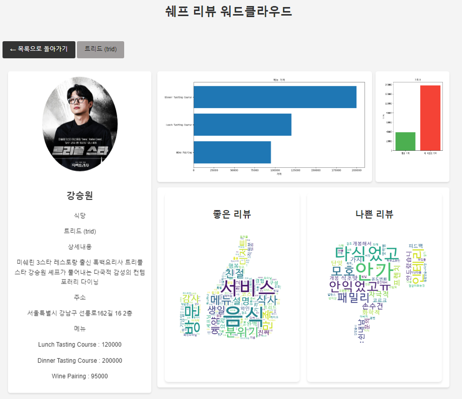
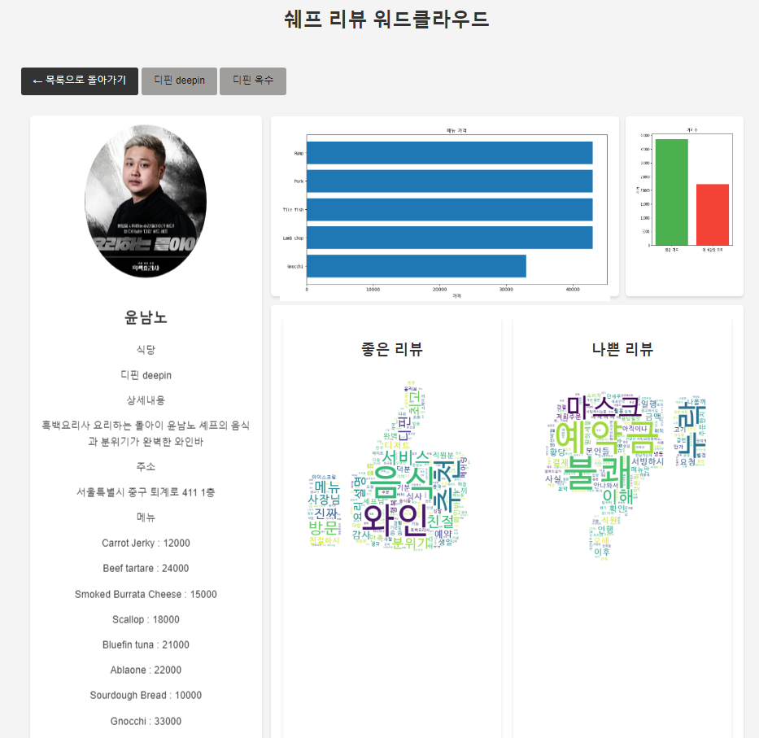
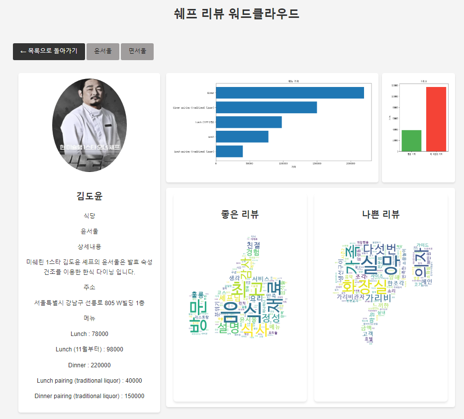

# crawl_restaurant
흑백요리사에 나온 식당들 리뷰 시각화 서비스

# 초기 데이터 설정방법
- 기존 Model존재 시 삭제, makemigrations, migrate 필요
- init_db.py 실행 (이후 크롤링 수행)
 
# 크롤링 방법
- crawling.py 실행 -> 리뷰 제외한 식당 데이터 DB에 입력 (약 8분 소요)
- ReviewCrawl.py 실행 -> 리뷰 데이터 DB에 입력 (약 25분 소요)
- **두 코드 순서대로 실행하시면 됩니다.**

# main화면 확인
    - 127.0.0.1:8000/restaurant

